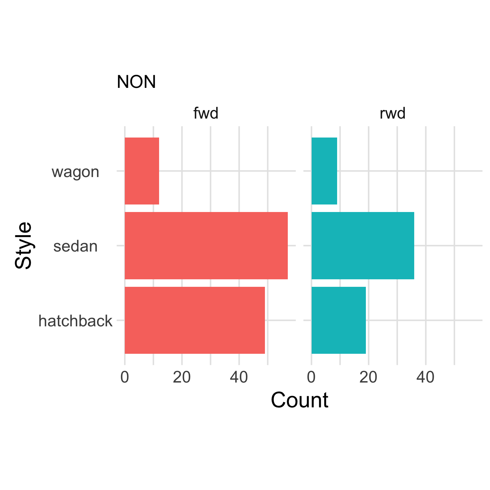
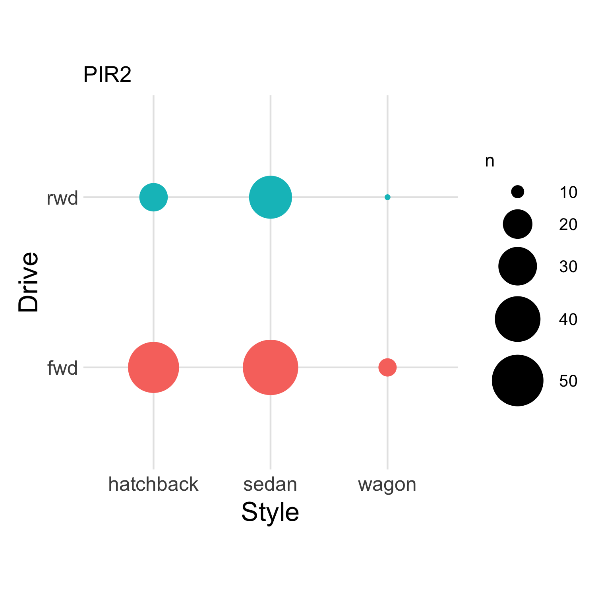
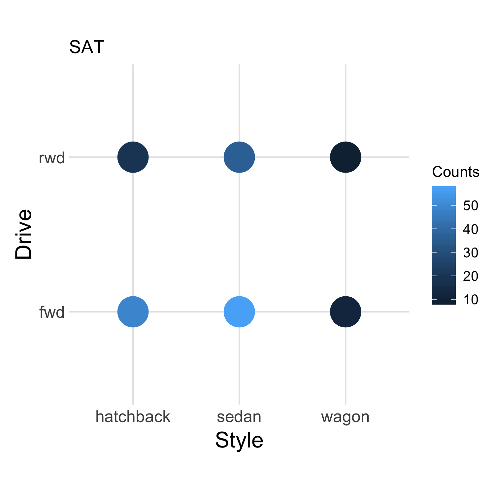
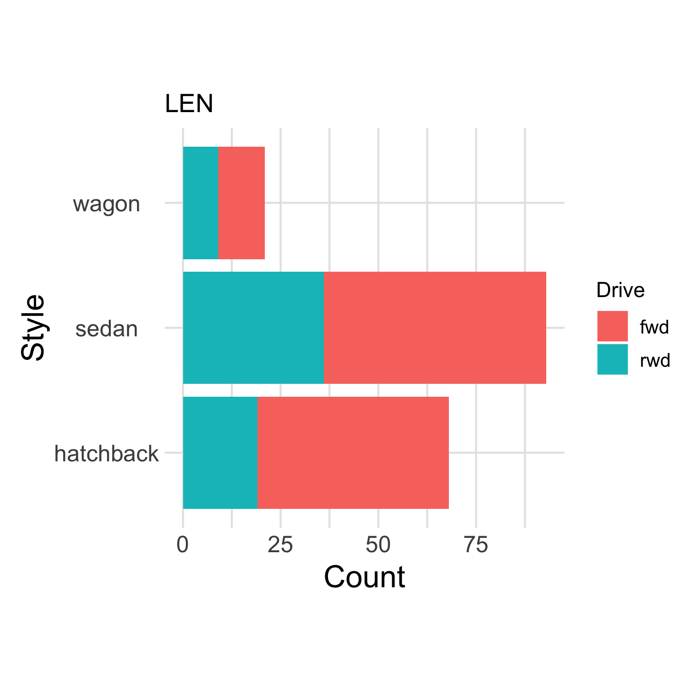
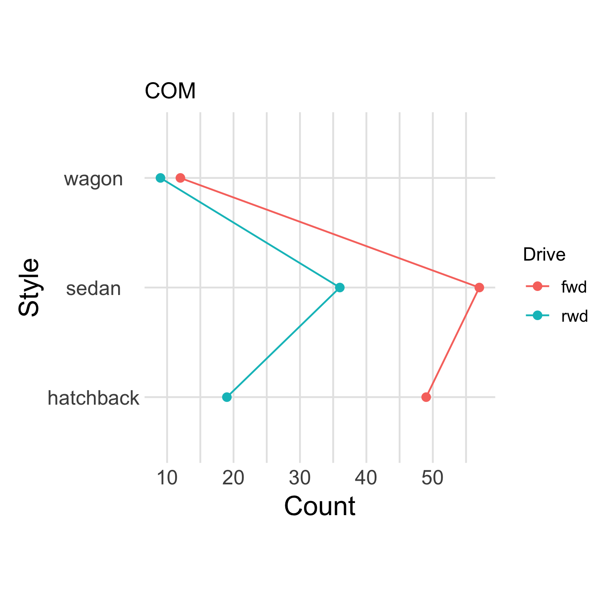
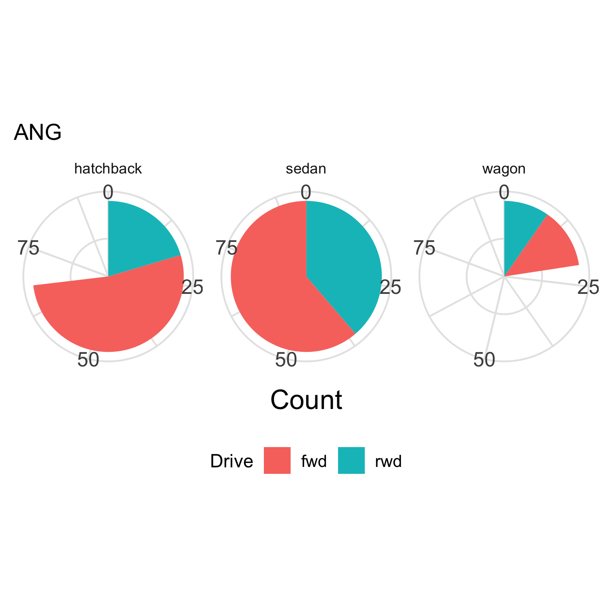

## Overview

You should be organized into pairs in breakout rooms.

Below there are **six** images of **the same** dataset. All images show exactly
the same information, but in different ways. The purpose of this exercise is to
learn which ways of showing data are more or less effective.

With your partner, look at the images below and follow the **three**
instructions:

## Instructions

### 1: Determine "Which is larger, and by how much?"

|          |                     |
|----------|---------------------|
| Count of | `wagons` with `fwd` |
|          | OR                  |
| Count of | `wagons` with `rwd` |

### 2: Rank the six visualizations in terms of how well they help you answer Q1. Rank the *most helpful* as `1`, and the *least helpful* as `6`.

### 3: **Submit your ranks**

## Images to Rank

__A) NON__

__B) PIR2__

__C) SAT__

__D) LEN__

__E) COM__

__F) ANG__

## Submit your ranks

When you've ranked all six, submit them
[here](https://forms.gle/i4jDkGZvAXeWiJX67).
