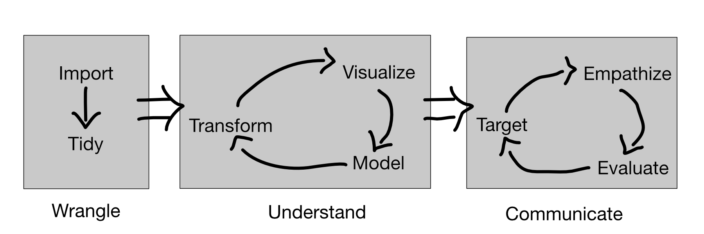

## The Big Picture
Figure 1 illustrates the *data-usage pipeline*; the full lifecycle of wrangling,
understanding, and communicating data. This is the framework for the entire
class.

<figure>
  
  <figcaption>Figure 1. The data-usage pipeline. Inspired
  by <a href="https://r4ds.had.co.nz/introduction.html">Grolemund and
  Wickham</a>.</figcaption>
</figure>

| ----------- | --------- | ---------------------------------------- |
| Wrangle     | Import    | Import data into programming environment |
|             | Tidy      | Reshape the data into a usable format    |
| Understand  | Transform | Perform numerical operations on data     |
|             | Visualize | Create graphical displays of data        |
|             | Model     | Construct a statistical model of data    |
| Communicate | Target    | Determine audience and message           |
|             | Empathize | Identify audience perspective and align  |
|             | Evaluate  | Deliver the message and gather feedback  |

## Principles
In class, we covered a few introductory principles:

- Visual
  - Use higher rungs on *the visual hierarchy* for numerical variables
  - **But**, always design for your intended purpose
- Rhetorical
  - Providing evidence for an argument improves your credibility (ethos)
  - Providing evidence for an argument is a key part of logic (logos)
  - *Consider* using an emotional appeal (pathos)

## Grading
There are several assignment types in this class, which will be graded on
different bases:

| Assignment Type | Grading Basis | Percentage |
| --- | --- | --- |
| Daily | Completion | 60% |
| Challenge | Rubric | 10% |
| Spotlight | Completion | 5% |
| Deep Dive: Draft | Rubric | 5% |
| Deep Dive: Peer review | Rubric | 5% |
| Deep Dive: Presentation | Rubric | 5% |
| Deep Dive: Final report | Rubric | 10% |

**Daily Assignments** are assigned (and due!) daily. They will be graded for
completion. The literature on education indicates that distributed *e.g. daily)
practice aids [retention](http://www.jamesmlang.com/p/small-teaching.html) and
[transfer](https://www.hup.harvard.edu/catalog.php?isbn=9780674660021) of
knowledge, so that's what we're going to do! These are short, so you'll only
need to spend about 15 min a day on these.

**Challenges** are longer assignments that will have you analyze **real** data
in order to extract insights. These will be graded on a rubric. Completing these
will take up to an hour each.

**Spotlights** will begin three weeks into the class, and will consist of a data
analysis and brief presentation to the class. You will do *one* of these in the
semester, and you will be graded based on completion. This will be graded for
completion. You will have to choose your own data for this small investigation;
you're free to find a dataset that interests you, but you can also choose one
from [tidytuesday](https://github.com/rfordatascience/tidytuesday).

The **Deep Dive** is your final course project, and will make up a large chunk
of your grade. It is broken into multiple parts:

- The Deep Dive itself is a full execution of the *data-usage pipeline*. You
  must identify a dataset of interest, explore and understand it, then construct
  and present an argument to the class.
- The project **Draft** will be due in week 8; this will consist of a
  reproducible data analysis, as well as a sketch of your argument.
- You will be assigned to read two of your classmates drafts in a **Peer
  review** assignment. You will be graded on the quality of the feedback you
  provide!
- The **Presentation** will be a (relatively) low-stakes communication of your
  report to the full class. This will be graded on a rubric, and will provide
  you with useful feedback as you prepare for...
- The **Final report** will be your last opportunity to refine your data
  analysis and argument. This will be graded on a rubric.


