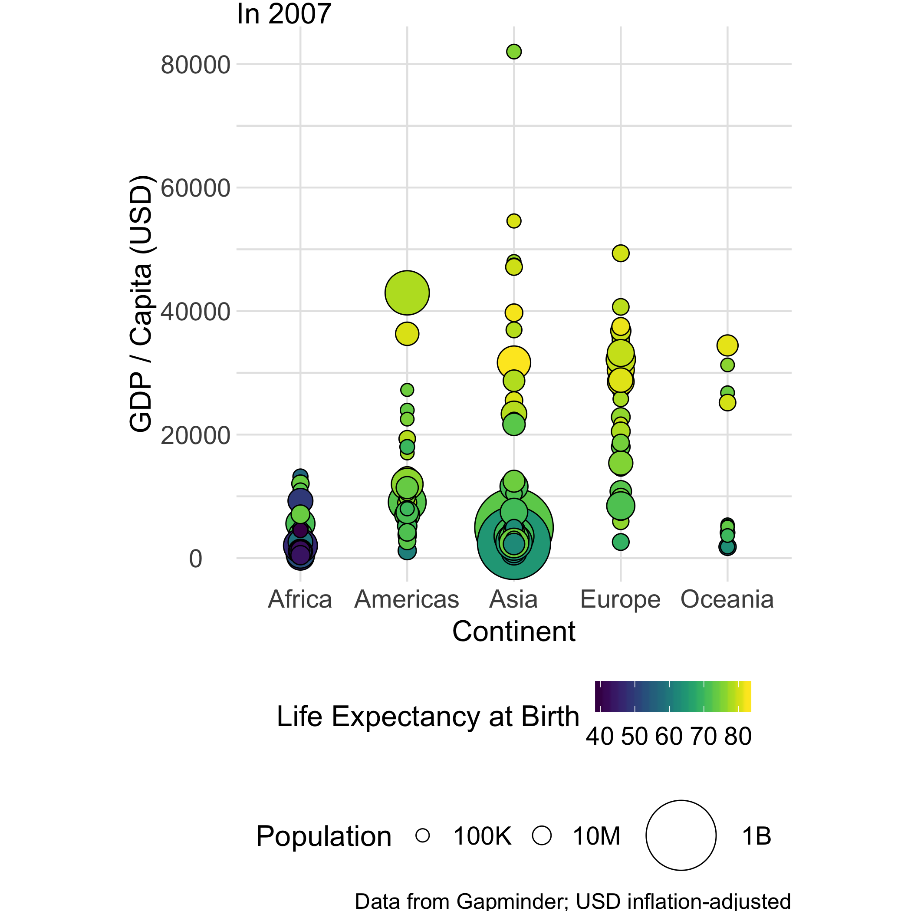
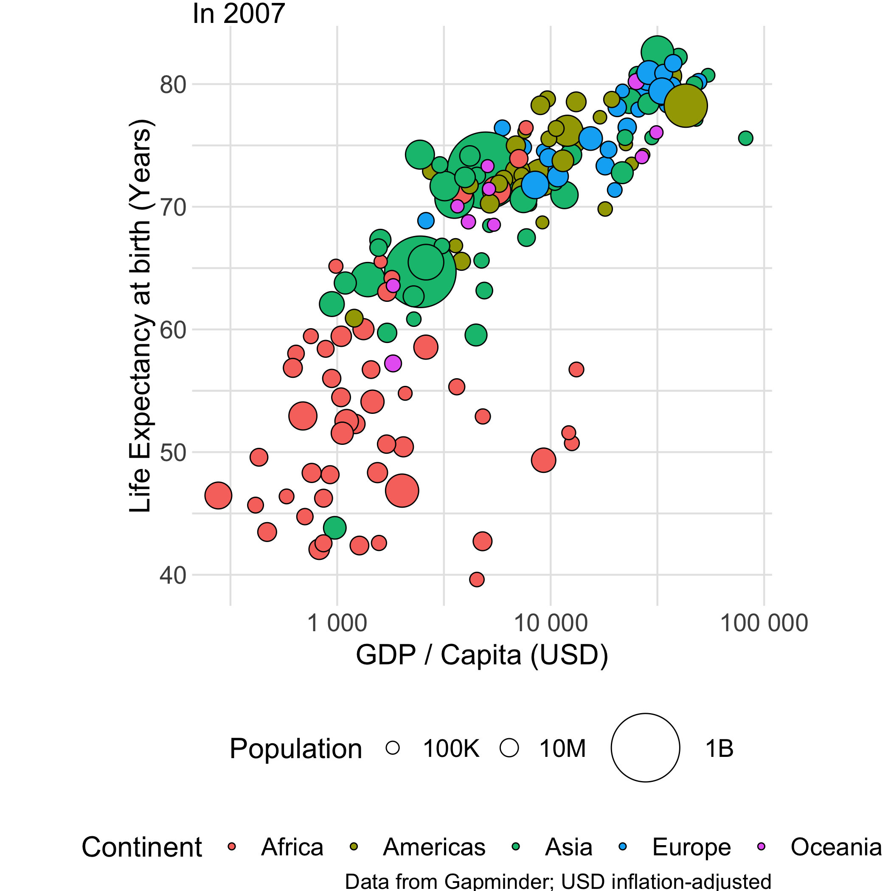

## Overview

You should have been organized into groups of four in breakout rooms.

Below there are **two** images of **the same** dataset. All images show exactly
the same information, but in different ways. The purpose of this exercise is 1.
Practice identifying the rungs on the visual hierarchy (see reference below for
a reminder), and 2. Use the visual hierarchy to help criticize the graphs.

With your group, look at the images below and follow the **three** instructions:

## Instructions

### 1: Determine the Rungs

Under **Images to Study**, identify how each of the **four variables** are
visualized, according to the the visual hierarchy.

For instance, in Image A, `GDP / Capita` is shown using a **common scale**. The
four variables are:

- `GDP / Capita`
- `Life Expectancy at Birth`
- `Population`
- `Continent`

### 2: Rank the Images

Determine which image---`A` or `B`---more closely follows our principle:

Principle: For numerical values, use  the highest rungs on *the visual hierarchy*.

**Be ready to justify your answer.**

## The Visual Hierarchy

For reference, and in **descending** order of perceptual accuracy, the visual
hierarchy is:

| Rank | Code | Detail |
|---|-----|--------------|
| 1 | COM | Common scale |
| 2 | NON | Non-aligned scale |
| 3 | LEN | Length |
| 4 | ANG | Angle; Slope |
| 5 | PIR2 | Area |
| 6 | SAT | Color saturation (Volume, Density) |
| 7 |     | Color hue |

## Images to Study

### Image A

---

### Image B

---

