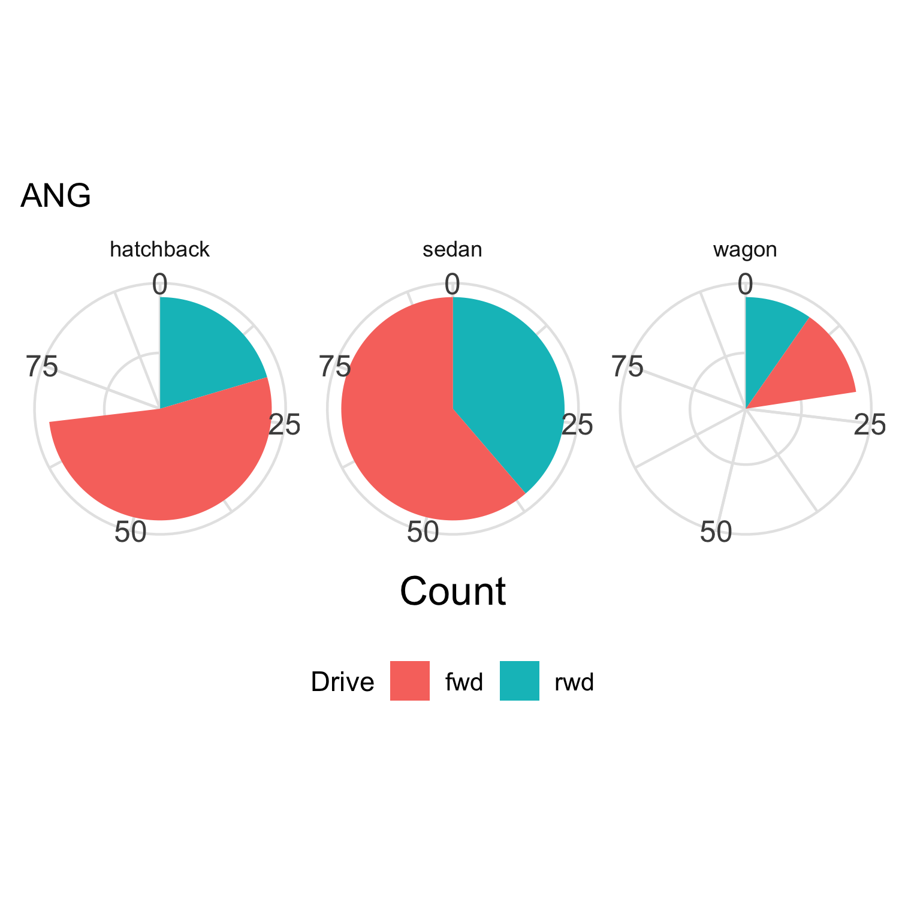

## Overview

In **descending** order of perceptual accuracy, the visual hierarchy is:

|   |     |              |
|---|-----|--------------|
| 1 | COM | Common scale |
| 2 | NON | Non-aligned scale |
| 3 | LEN | Length |
| 4 | ANG | Angle; Slope |
| 5 | PIR2 | Area |
| 6 | SAT | Color saturation (Volume, Density) |
| 7 |     | Color hue |

## Visual reference

__1. COM__

---

__2. NON__

---

__3. LEN__

---

__4. ANG__

---

__5. PIR2__

---

__6. SAT__

---

